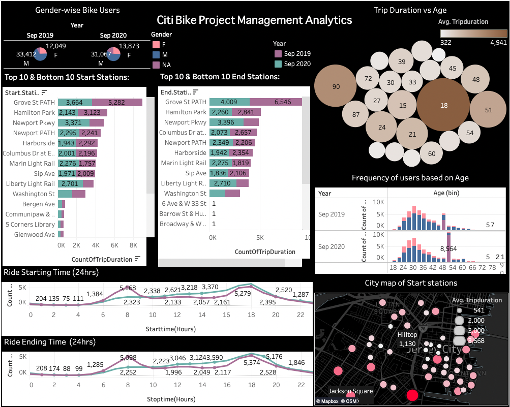

# Citi Bike Project Analytics in Tableau

This project showcases the analysis of Citi Bike data in Tableau. The goal is to gain insights into the usage patterns of Citi Bike in New York City, including popular bike stations, trip duration, and user behavior.

## Data
The data used for this project was obtained from the Citi Bike System Data website (https://www.citibikenyc.com/system-data). The data includes information about bike trips, such as start and end station, trip duration, and user information (e.g. subscriber status, birth year).

## Tableau Workbook
The Tableau workbook contains multiple worksheets, each showcasing a different aspect of the analysis. The worksheets include:

1.A map showing the location of Citi Bike stations and the number of bikes available

2. Bar charts showing the top start and end stations

3. Line charts showing the usage patterns over time

4. Histograms and box plots displaying the distribution of trip duration

5. Dashboards summarizing the insights and enabling easy navigation between the worksheets

## Overview

And finally, the Dashboard,

## Conclusion
This project provides a comprehensive analysis of Citi Bike usage in New York City, enabling users to gain insights into the popularity of different bike stations, trip duration, and user behavior. The Tableau workbook is a valuable tool for anyone interested in understanding the patterns of bike usage in the city.

